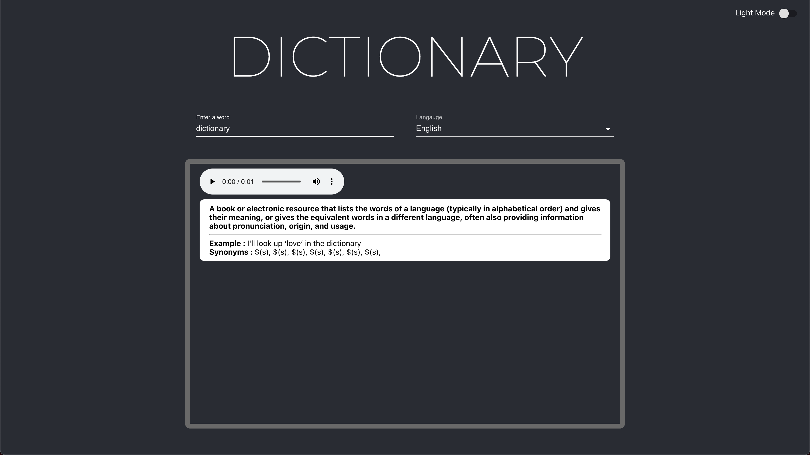

# dictionary-app

dictionary-app is a 12 language React application. 

## Installation

Clone the repo and use npm to install dictionary-app.

```bash
npm install 
```

## Screenshots



## Authors and acknowledgment
This application was created using a YouTube video by RoadsideCoder and uses an API by meetDeveloper. 

YouTube video: https://www.youtube.com/watch?v=Nz6Q21ypzT4&t=5s
API: https://dictionaryapi.dev/

## License
[MIT](https://choosealicense.com/licenses/mit/)
